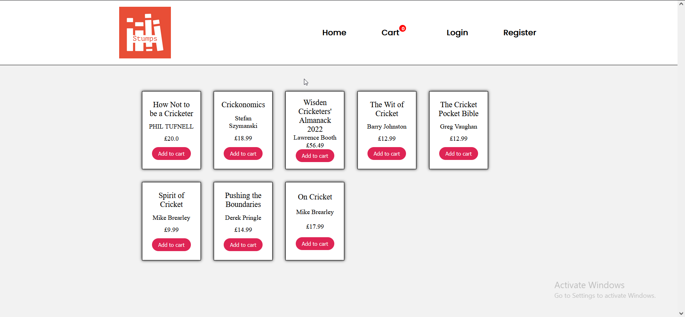
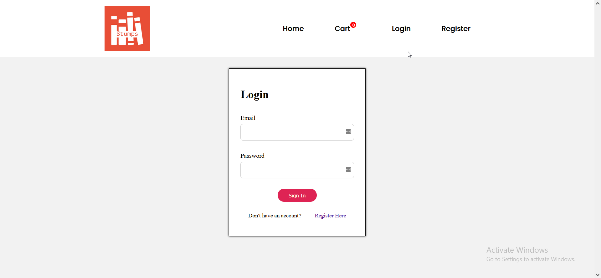
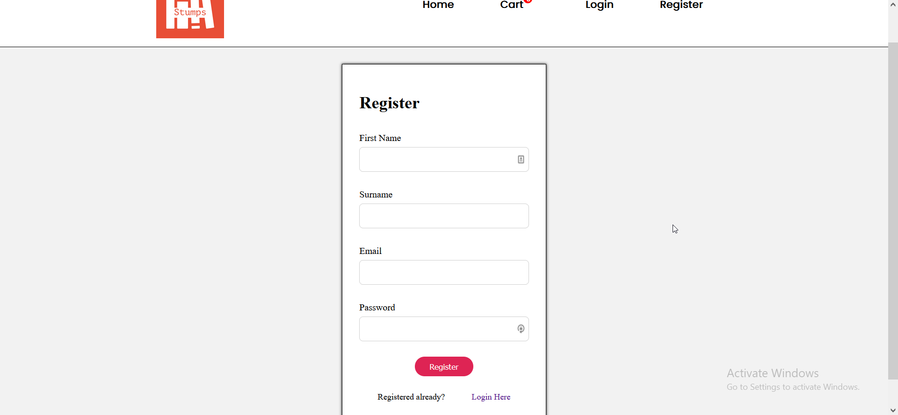
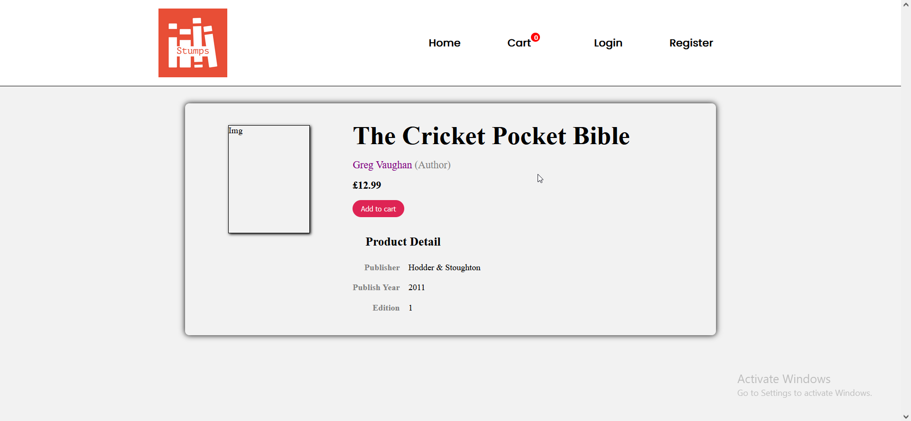
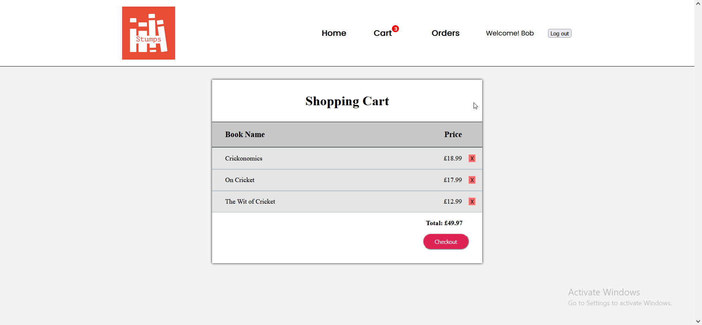
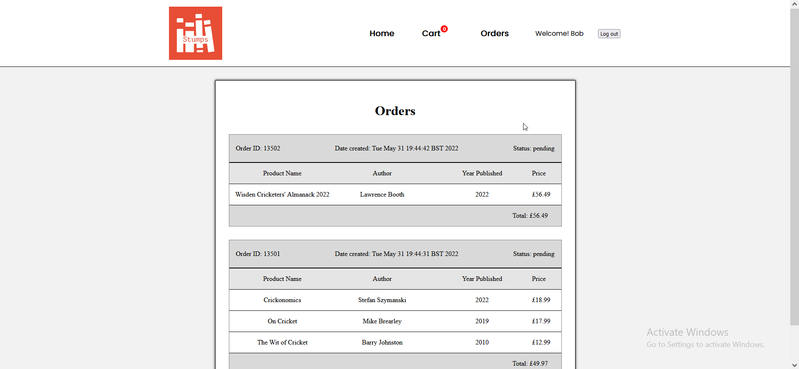
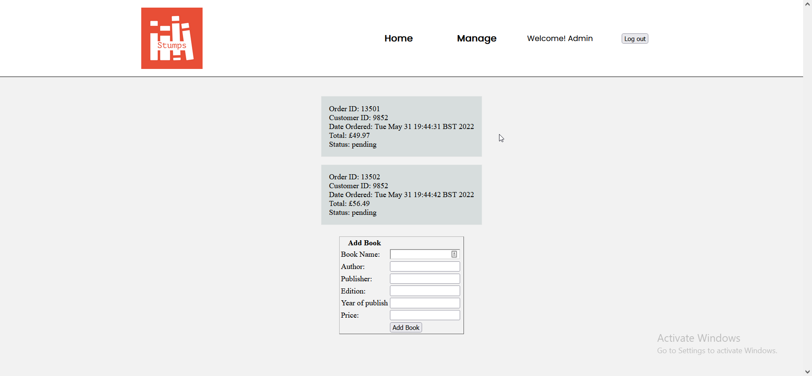

# Stumps-Book-Shop

Enterprise Web Architectures (ENTWA) individual coursework  
E-commerce System: Cricket Book Shop

Stumps is an online book shop that allows users to:

- View Books
- Add books to cart
- Checkout cart
- Login & Register
- View orders
- Manager/Admin page

## Development

Development Versions:

- Java SE 8
- Glassfish 5.1.0
- Java EE 8

Used technologies such as:

- JavaServer Faces (JSF)
- Java Persistence API (JPA)
- Java Persistence Query Language (JPQL)
- Enterprise Java Beans (EJB)
- Servlets
- CSS for styling

### Images of site: 

